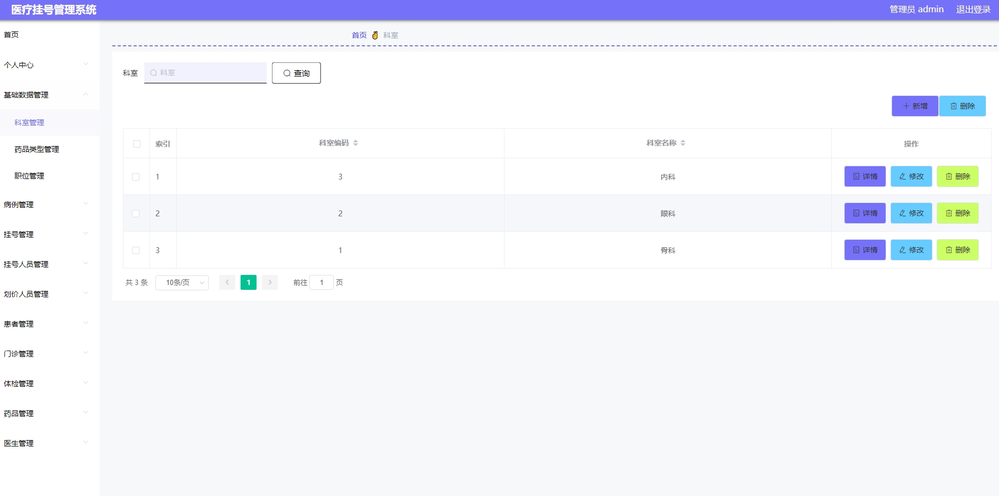
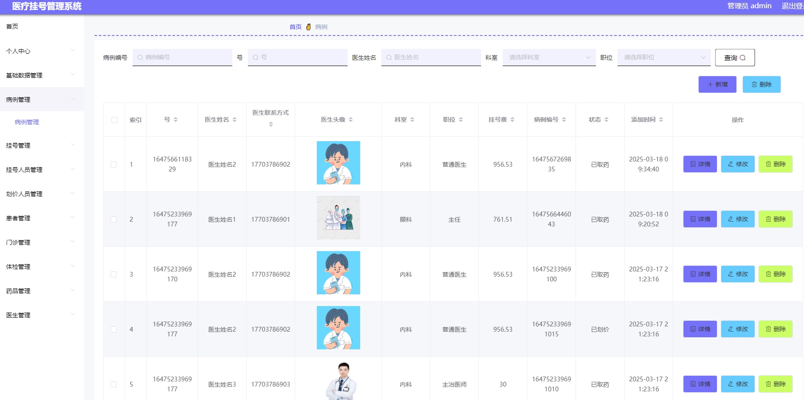
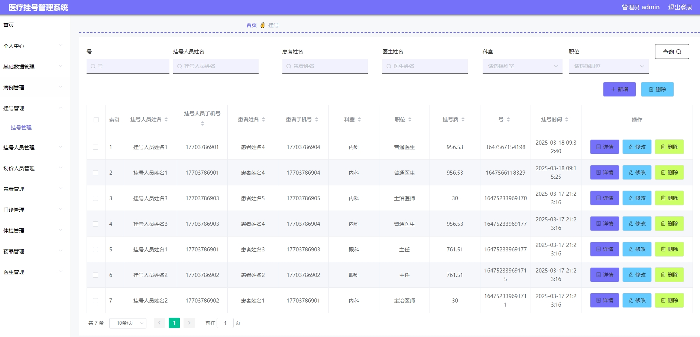
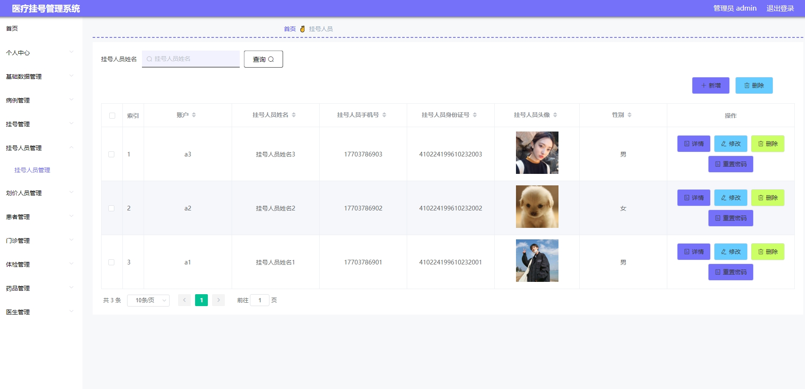
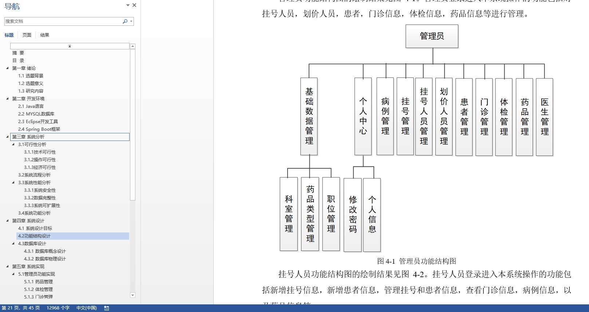

# 1.项目介绍
- 系统角色：管理员、挂号人员、划价人员、医生
- 功能模块：患者管理、医生管理、划价人员管理、病历管理、门诊管理、挂号人员管理、体检管理、药品管理、科室管理、职位管理等
- 技术选型：SpringBoot，vue等
- 测试环境：idea2024，jdk1.8，mysql5.7，maven3，node14.16.1
# 2.项目部署
## 2.1 后端部署
- 创建数据库，导入sql文件
- idea打开目录server，根据本地数据库环境修改src/main/resources/application.yml 11-14行
- 启动项目src/main/java/com/yiliaoguahaoApplication.java
## 2.2 管理web
- idea（安装vue.js插件）或者webstorm、vscode等ide工具打开项目client(命令行操作也可以）
- 进入终端，输入 npm install安装依赖（下载失败自行配置阿里的镜像加速）
- 启动项目 npm run serve
- 打开终端的地址，输入账号密码：管理员（admin、123456）其他角色自行查表
# 3.项目部分截图

# 4.获取方式
[戳我查看](https://gitee.com/aven999/mall)
